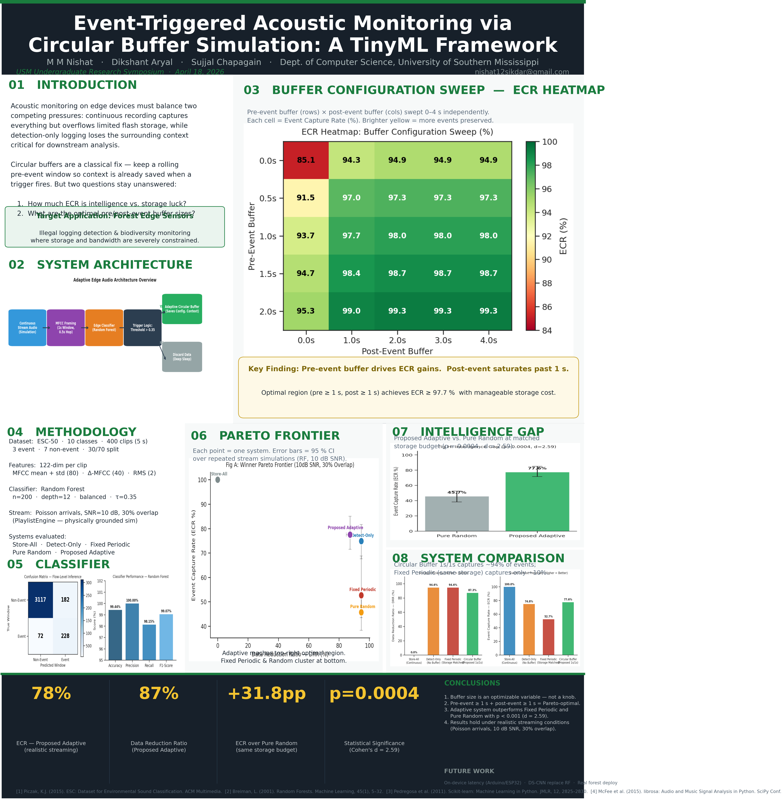

# Event-Triggered Acoustic Monitoring via Circular Buffer Simulation
### A TinyML Framework for Edge Deployment

**USM Undergraduate Symposium 2026**

**Authors:** Dikshant Aryal, M M Nishat, Sujjal Chapagain

---



---

## Overview

Continuous ecological acoustic monitoring exhausts edge device storage and battery life in off-grid environments like De Soto National Forest. Recording only the exact trigger moment discards critical contextual audio needed by researchers.

This project simulates a **circular buffer strategy** on top of a TinyML event detector to quantify the storage vs. event-preservation trade-off. We show that a **1-second pre/post buffer** achieves near-optimal utility under realistic streaming conditions.

**Key finding:** A 1s/1s circular buffer reduces storage by **87%** while preserving **78%** of sound events — and an intelligent detector outperforms random selection by **+31.8 percentage points** (p=0.0004, d=2.59).

---

## Results

Evaluated over 10 repetitions at 10 dB SNR, 30% event overlap (realistic streaming conditions):

| System | DRR | ECR |
|---|---|---|
| Store-All (Baseline) | 0.0% | 100.0% |
| Detect-Only (No Buffer) | 94.6% | 74.8% |
| Fixed Periodic (Storage-Matched) | 94.6% | 52.7% |
| Pure Random (Storage-Matched) | 94.6% | 45.7% |
| **Circular Buffer — Proposed 1s/1s** | **87.3%** | **77.6%** |

- **DRR** (Data Reduction Ratio): fraction of audio discarded — higher = less storage used
- **ECR** (Event Capture Rate): fraction of true sound events preserved — higher = better

**Intelligence gap:** Proposed Adaptive vs. Pure Random = +31.8 pp ECR (p=0.0004, Cohen's d=2.59)

---

## Repository Structure

```
.
├── tinyml-acoustic/
│   ├── pipeline.py          # Full ML pipeline: training, simulation, evaluation
│   ├── playlist_engine.py   # Realistic stream generator (SNR, overlap, augmentation)
│   ├── physics_model.py     # Edge hardware resource model (SRAM, Flash, MACs)
│   ├── figures/             # Generated output figures
│   └── results/             # JSON metrics from each pipeline run
│       ├── winner_metrics.json    # Final results — realistic streaming (10 runs)
│       ├── stability_metrics.json # Buffer sweep results
│       └── metrics.json           # Single-run classifier metrics
├── make_figures.py          # Regenerate all figures from saved JSON (no retraining needed)
├── make_poster.py           # Generate poster_ugs2026.png
├── make_handout.py          # Generate handout_ugs2026.png
├── poster_ugs2026.png       # Final symposium poster
└── handout_ugs2026.png      # QR handout
```

---

## Setup & Run

### 1. Download ESC-50

```bash
git clone https://github.com/karolpiczak/ESC-50 tinyml-acoustic/data/ESC-50-master
```

### 2. Create virtual environment

```bash
cd tinyml-acoustic
python3 -m venv venv
source venv/bin/activate
pip install numpy pandas librosa scikit-learn matplotlib seaborn scipy tqdm joblib reportlab
```

### 3. Run the full pipeline (trains model + runs simulations)

```bash
python3 tinyml-acoustic/pipeline.py
```

Output: figures saved to `tinyml-acoustic/figures/`, metrics to `tinyml-acoustic/results/`.

### 4. Regenerate figures only (no retraining)

```bash
python3 make_figures.py
```

### 5. Regenerate poster and handout

```bash
python3 make_poster.py
python3 make_handout.py
```

---

## Pipeline

```
ESC-50 Dataset
    → Continuous Stream Simulation (PlaylistEngine — SNR, overlap, augmentation)
    → MFCC + Delta Feature Extraction (1s window, 0.5s hop, 40 coefficients)
    → Random Forest Classifier (100 estimators, depth 12, class-balanced)
    → Multi-System Evaluation (Store-All, Detect-Only, Fixed Periodic, Pure Random, Proposed Adaptive)
    → Bootstrap CI (1000 resamples, 10 runs) + Mann-Whitney U significance test
    → Figures + JSON metrics
```

---

## Citation

```
Aryal, D., Nishat, M. M., & Chapagain, S. (2026).
Event-Triggered Acoustic Monitoring via Circular Buffer Simulation:
A TinyML Framework for Edge Deployment.
USM Undergraduate Symposium 2026.
```

Dataset: [ESC-50](https://github.com/karolpiczak/ESC-50) — Piczak, K. J. (2015)
